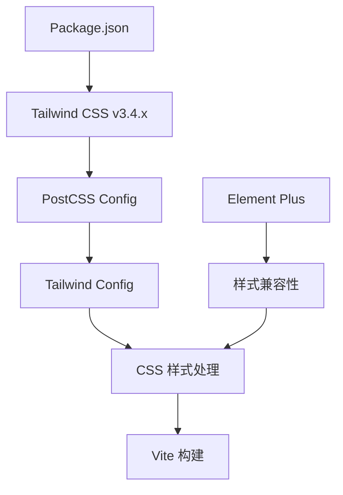
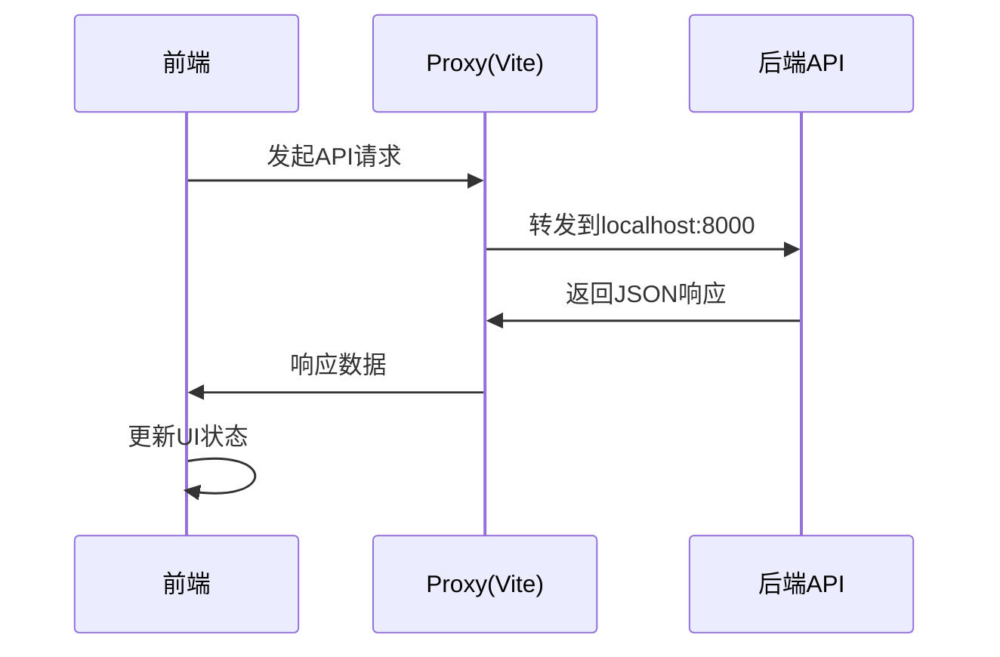

# Tailwind CSS配置修复设计文档

## 概述

本文档描述了修复小说爬虫前端项目中Tailwind CSS配置错误的技术方案。错误的根本原因是项目使用了Tailwind CSS v4.x版本，但仍然采用了v3.x的配置方式，导致PostCSS插件无法正确加载。

## 问题分析

### 错误现象
```
[plugin:vite:css] [postcss] It looks like you're trying to use `tailwindcss` directly as a PostCSS plugin. The PostCSS plugin has moved to a separate package
```

### 根本原因
1. **版本冲突**：项目安装了Tailwind CSS v4.1.13，但配置文件仍使用v3.x语法
2. **PostCSS配置过时**：postcss.config.js中直接引用`tailwindcss`，v4需要`@tailwindcss/postcss`
3. **配置文件格式变更**：v4采用新的配置格式和导入方式

### 影响范围
- 前端开发服务器无法启动
- 样式编译失败
- 开发体验受阻

## 技术方案

### 方案一：降级到Tailwind CSS v3.x（推荐）

#### 架构设计


#### 依赖版本规划
| 包名 | 当前版本 | 目标版本 | 变更原因 |
|------|----------|----------|----------|
| tailwindcss | ^4.1.13 | ^3.4.17 | 确保配置兼容性 |
| @tailwindcss/typography | ^0.5.16 | ^0.5.16 | 保持不变 |
| postcss | ^8.5.6 | ^8.5.6 | 保持不变 |
| autoprefixer | ^10.4.21 | ^10.4.21 | 保持不变 |

#### 配置文件调整

**PostCSS配置保持不变**：
```javascript
// postcss.config.js
export default {
  plugins: {
    tailwindcss: {},
    autoprefixer: {},
  },
}
```

**Tailwind配置优化**：
```javascript
// tailwind.config.js - 保持现有配置，确保v3兼容性
/** @type {import('tailwindcss').Config} */
export default {
  content: ["./index.html", "./src/**/*.{vue,js,ts,jsx,tsx}"],
  darkMode: 'class',
  theme: {
    extend: {
      // 现有主题配置保持不变
    },
  },
  plugins: [
    require('@tailwindcss/typography'),
  ],
}
```

### 方案二：升级到Tailwind CSS v4.x（备选）

#### 架构变更
```mermaid
graph TB
    A[Package.json] --> B[Tailwind CSS v4.1.x]
    B --> C[@tailwindcss/postcss]
    C --> D[CSS导入方式]
    D --> E[新配置格式]
    E --> F[Vite 构建]
    
    G[迁移工具] --> H[配置转换]
    H --> E
```

#### 配置文件重构

**PostCSS配置更新**：
```javascript
// postcss.config.js
export default {
  plugins: {
    '@tailwindcss/postcss': {},
    autoprefixer: {},
  },
}
```

**CSS导入方式变更**：
```css
/* src/assets/main.css */
@import "tailwindcss";
```

**配置文件格式变更**：
```javascript
// tailwind.config.js - v4新格式
import { Config } from 'tailwindcss'

export default {
  content: ["./index.html", "./src/**/*.{vue,js,ts,jsx,tsx}"],
  // v4配置格式调整
} satisfies Config
```

## 实施计划

### 阶段一：环境修复（推荐方案一）

1. **依赖降级**
   - 卸载Tailwind CSS v4
   - 安装Tailwind CSS v3.4.17
   - 验证配置兼容性

2. **配置验证**
   - 检查postcss.config.js
   - 验证tailwind.config.js
   - 测试样式编译

3. **功能测试**
   - 启动开发服务器
   - 验证样式加载
   - 测试响应式布局

### 阶段二：前后端集成测试

#### API接口测试矩阵

| 接口 | 方法 | 测试场景 | 预期结果 |
|------|------|----------|----------|
| /api/search | POST | 搜索小说 | 返回搜索结果列表 |
| /api/catalog | POST | 获取目录 | 返回章节列表 |
| /api/download/start | POST | 开始下载 | 返回任务ID |
| /api/download/status/{task_id} | GET | 查询进度 | 返回下载状态 |
| /api/download/tasks | GET | 任务列表 | 返回所有任务 |

#### 集成测试流程


### 阶段三：性能优化

#### 样式加载优化
- **CSS代码分割**：按页面拆分样式
- **树摇优化**：移除未使用的Tailwind类
- **缓存策略**：优化构建产物缓存

#### 网络请求优化
- **请求拦截器**：统一错误处理
- **加载状态**：优化用户体验
- **重试机制**：网络异常处理

## 测试验证

### 样式功能测试

1. **基础样式测试**
   ```vue
   <template>
     <div class="bg-primary-500 text-white p-4 rounded-lg shadow-lg">
       Tailwind样式测试
     </div>
   </template>
   ```

2. **响应式测试**
   ```vue
   <template>
     <div class="grid grid-cols-1 md:grid-cols-2 lg:grid-cols-3 gap-4">
       <div class="bg-white dark:bg-dark-800 p-4">响应式卡片</div>
     </div>
   </template>
   ```

3. **动画测试**
   ```vue
   <template>
     <div class="animate-fade-in hover:animate-bounce-light">
       自定义动画测试
     </div>
   </template>
   ```

### API集成测试

1. **搜索功能测试**
   ```typescript
   // 测试用例：搜索小说
   const searchResponse = await fetch('/api/search', {
     method: 'POST',
     headers: { 'Content-Type': 'application/json' },
     body: JSON.stringify({ keyword: '剑来' })
   });
   
   expect(searchResponse.status).toBe(200);
   expect(searchResponse.data).toHaveProperty('data');
   ```

2. **下载功能测试**
   ```typescript
   // 测试用例：开始下载任务
   const downloadResponse = await fetch('/api/download/start', {
     method: 'POST',
     headers: { 'Content-Type': 'application/json' },
     body: JSON.stringify({
       novel_url: '/book/29799/',
       book_name: '剑来',
       start_chapter: 1,
       end_chapter: 10,
       mode: 'txt'
     })
   });
   
   expect(downloadResponse.status).toBe(200);
   expect(downloadResponse.data).toHaveProperty('task_id');
   ```

## 风险控制

### 技术风险
- **版本兼容性**：降级可能影响某些新特性
- **样式差异**：v3与v4在某些类名上可能有差异
- **构建性能**：v3可能在构建速度上略逊于v4

### 缓解措施
- **渐进式升级**：先确保基础功能正常，再考虑新特性
- **样式审查**：逐页检查样式是否正常
- **性能监控**：对比修复前后的构建时间

### 回滚方案
如果降级方案出现问题，可以：
1. 恢复到v4版本
2. 采用方案二进行完整升级
3. 临时禁用Tailwind，使用纯CSS

## 部署注意事项

### 开发环境
- 确保Node.js版本兼容（>=20.19.0）
- 清理node_modules和package-lock.json
- 重新安装依赖

### 生产环境
- 验证构建产物大小
- 检查CSS压缩效果
- 确认样式加载正常

### 监控指标
- 首屏加载时间
- CSS文件大小
- 构建时间
- 热更新性能