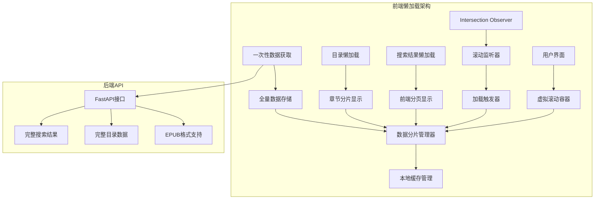
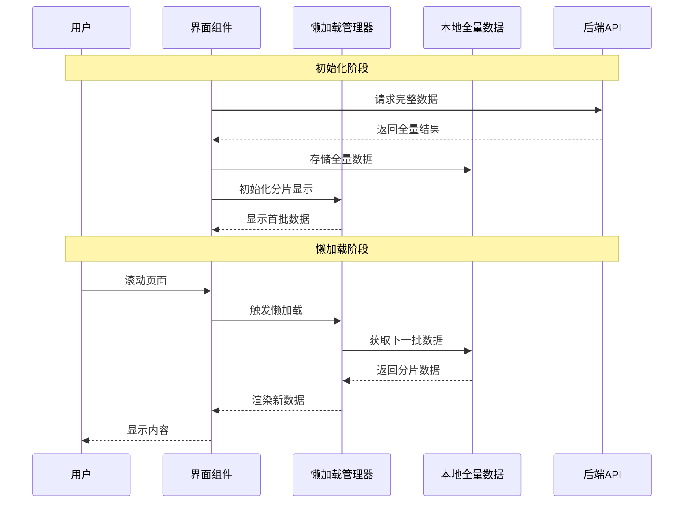

# 前端懒加载优化设计文档

## 概述

本文档描述了小说爬虫项目前端的懒加载优化方案，主要包括搜索结果懒加载、小说目录懒加载、移除收藏和历史功能、以及后端epub格式支持等核心优化内容。

## 技术栈
- **前端框架**: Vue 3 + TypeScript
- **UI组件库**: Element Plus + Tailwind CSS  
- **状态管理**: Pinia
- **构建工具**: Vite
- **HTTP客户端**: Axios
- **后端**: FastAPI + Scrapy

## 架构设计

### 懒加载架构模式



### 数据流设计



## 核心功能设计

### 1. 搜索结果懒加载

#### 组件设计
```typescript
interface SearchResultLazyLoader {
  // 分页配置
  pageSize: number;           // 每页显示数量 (默认20)
  currentPage: number;        // 当前页码
  totalResults: number;       // 总结果数
  
  // 懒加载状态
  isLoading: boolean;         // 是否正在加载
  hasMore: boolean;           // 是否有更多数据
  loadDistance: number;       // 触发加载的距离阈值
  
  // 数据管理
  displayedResults: BookItem[];  // 当前显示的结果
  allResults: BookItem[];        // 全部搜索结果
  
  // 方法
  loadMore(): Promise<void>;     // 加载更多数据
  resetResults(): void;          // 重置结果
  handleScroll(event: Event): void; // 滚动处理
}
```

#### 实现策略
- **一次性获取**: 首次搜索从后端获取全部结果数据
- **本地存储**: 将全量数据存储在前端内存中
- **分片显示**: 初始显示前20条结果，后续分批显示
- **滚动监听**: 使用Intersection Observer API监听滚动位置
- **触发条件**: 距离底部200px时从本地数据中加载下一批
- **批量显示**: 每次显示20条数据，模拟网络加载效果
- **加载状态**: 显示loading指示器和"加载更多"按钮提升用户体验

#### 核心代码结构
```vue
<template>
  <div class="search-results-container">
    <!-- 搜索结果列表 -->
    <div class="results-grid">
      <BookCard 
        v-for="(book, index) in displayedResults" 
        :key="`${book.articlename}-${index}`"
        :book="book"
        @click="selectBook(book)"
      />
    </div>
    
    <!-- 懒加载触发器 -->
    <div 
      ref="loadTrigger" 
      v-show="hasMore"
      class="load-trigger"
    >
      <LoadingSpinner v-if="isLoading" />
      <BaseButton 
        v-else 
        @click="loadMore"
        class="load-more-btn"
      >
        加载更多 ({{ remainingCount }}条)
      </BaseButton>
    </div>
    
    <!-- 无更多数据提示 -->
    <div v-if="!hasMore && displayedResults.length > 0" class="no-more-hint">
      已显示全部 {{ totalResults }} 条结果
    </div>
  </div>
</template>

<script setup lang="ts">
import { ref, computed, onMounted, onUnmounted } from 'vue';
import { useIntersectionObserver } from '@/composables/useIntersectionObserver';

const displayedResults = ref<BookItem[]>([]);
const currentPage = ref(1);
const pageSize = ref(20);
const isLoading = ref(false);
const loadTrigger = ref<HTMLElement>();

const hasMore = computed(() => 
  displayedResults.value.length < allResults.value.length
);

const remainingCount = computed(() => 
  allResults.value.length - displayedResults.value.length
);

// 懒加载逻辑
const loadMore = async () => {
  if (isLoading.value || !hasMore.value) return;
  
  isLoading.value = true;
  const start = currentPage.value * pageSize.value;
  const end = start + pageSize.value;
  
  // 模拟网络加载延迟，提升用户体验
  await new Promise(resolve => setTimeout(resolve, 300));
  
  // 从本地全量数据中获取下一批
  const nextBatch = allResults.value.slice(start, end);
  displayedResults.value.push(...nextBatch);
  
  currentPage.value++;
  isLoading.value = false;
  
  // 记录加载统计
  console.log(`已加载 ${displayedResults.value.length}/${allResults.value.length} 条结果`);
};

// Intersection Observer 监听
const { stop } = useIntersectionObserver(
  loadTrigger,
  ([{ isIntersecting }]) => {
    if (isIntersecting && hasMore.value && !isLoading.value) {
      loadMore();
    }
  },
  { threshold: 0.1 }
);

onUnmounted(() => {
  stop();
});
</script>
```

### 2. 小说目录懒加载

#### 设计思路
小说目录通常包含数百至数千章，一次性渲染会影响性能，采用虚拟滚动策略：

- **全量获取**: 后端一次性返回完整目录数据
- **虚拟渲染**: 只渲染可视区域内的章节，大幅提升性能
- **分片管理**: 前端将数据分为每片50章进行管理
- **预计算**: 预先计算滚动位置和可见范围
- **章节索引**: 提供快速跳转功能

#### 组件设计
```typescript
interface ChapterLazyLoader {
  chunkSize: number;           // 分片大小 (50章)
  loadedChunks: Set<number>;   // 已加载的分片
  currentChunk: number;        // 当前分片
  visibleChapters: Chapter[];  // 可见章节
  totalChapters: number;       // 总章节数
  
  // 虚拟滚动
  itemHeight: number;          // 章节项高度
  containerHeight: number;     // 容器高度  
  scrollTop: number;           // 滚动位置
  startIndex: number;          // 可见起始索引
  endIndex: number;            // 可见结束索引
  
  // 方法
  loadChunk(chunkIndex: number): Promise<void>;
  getChaptersByRange(start: number, end: number): Chapter[];
  jumpToChapter(chapterNumber: number): void;
}
```

#### 虚拟滚动实现
``vue
<template>
  <div class="chapter-list-container">
    <!-- 章节导航 -->
    <div class="chapter-nav">
      <div class="nav-info">
        共 {{ totalChapters }} 章
      </div>
      <div class="nav-jump">
        <input 
          v-model.number="jumpTarget"
          type="number" 
          :min="1" 
          :max="totalChapters"
          placeholder="跳转到章节"
          @keydown.enter="jumpToChapter"
        />
        <BaseButton @click="jumpToChapter" size="small">
          跳转
        </BaseButton>
      </div>
    </div>
    
    <!-- 虚拟滚动列表 -->
    <div 
      ref="scrollContainer"
      class="chapter-scroll-container"
      @scroll="handleScroll"
      :style="{ height: containerHeight + 'px' }"
    >
      <!-- 占位空间 -->
      <div :style="{ height: totalHeight + 'px', position: 'relative' }">
        <!-- 可见章节 -->
        <div
          v-for="(chapter, index) in visibleChapters"
          :key="chapter.url"
          class="chapter-item"
          :style="getItemStyle(startIndex + index)"
          @click="selectChapter(chapter)"
        >
          <span class="chapter-number">
            {{ getChapterNumber(startIndex + index) }}
          </span>
          <span class="chapter-title">
            {{ chapter.title }}
          </span>
        </div>
      </div>
      
      <!-- 加载指示器 -->
      <div v-if="isLoadingChunk" class="chunk-loading">
        <LoadingSpinner size="small" text="加载章节中..." />
      </div>
    </div>
  </div>
</template>

<script setup lang="ts">
import { ref, computed, watch, onMounted } from 'vue';

const scrollContainer = ref<HTMLElement>();
const itemHeight = 40; // 章节项高度
const containerHeight = 600; // 容器高度
const chunkSize = 50; // 分片大小

const scrollTop = ref(0);
const loadedChunks = ref(new Set<number>());
const allChapters = ref<Chapter[]>([]);
const isLoadingChunk = ref(false);

// 计算可见范围
const startIndex = computed(() => 
  Math.floor(scrollTop.value / itemHeight)
);

const endIndex = computed(() => 
  Math.min(
    startIndex.value + Math.ceil(containerHeight / itemHeight) + 1,
    allChapters.value.length
  )
);

const visibleChapters = computed(() => 
  allChapters.value.slice(startIndex.value, endIndex.value)
);

const totalHeight = computed(() => 
  allChapters.value.length * itemHeight
);

// 滚动处理
const handleScroll = (event: Event) => {
  const target = event.target as HTMLElement;
  scrollTop.value = target.scrollTop;
  
  // 检查是否需要加载新分片
  const currentChunk = Math.floor(startIndex.value / chunkSize);
  const nextChunk = Math.floor(endIndex.value / chunkSize);
  
  [currentChunk, nextChunk].forEach(chunk => {
    if (!loadedChunks.value.has(chunk)) {
      loadChunk(chunk);
    }
  });
};

// 初始化章节数据（从后端一次性获取）
const initializeChapters = async () => {
  try {
    // 从Store获取完整目录数据
    const catalogData = await bookStore.loadBookCatalog();
    allChapters.value = catalogData.chapters;
    totalChapters.value = catalogData.chapters.length;
    
    console.log(`目录加载完成，共 ${totalChapters.value} 章`);
  } catch (error) {
    console.error('加载目录失败:', error);
  }
};

// 获取指定范围的章节（用于虚拟滚动）
const getChaptersByRange = (start: number, end: number) => {
  return allChapters.value.slice(start, end);
};

// 章节定位样式
const getItemStyle = (index: number) => ({
  position: 'absolute',
  top: index * itemHeight + 'px',
  height: itemHeight + 'px',
  width: '100%'
});

// 跳转到章节
const jumpToChapter = (chapterNumber: number) => {
  const targetIndex = chapterNumber - 1;
  const targetScrollTop = targetIndex * itemHeight;
  
  if (scrollContainer.value) {
    scrollContainer.value.scrollTo({
      top: targetScrollTop,
      behavior: 'smooth'
    });
  }
};
</script>
```

### 3. 移除收藏和历史功能

#### 路由优化
移除以下路由配置：
```typescript
// 删除的路由
{
  path: '/favorites',
  name: 'Favorites', 
  component: () => import('@/views/FavoritesView.vue')
},
{
  path: '/history',
  name: 'ReadingHistory',
  component: () => import('@/views/HistoryView.vue')
}
```

#### 导航菜单清理
```vue
<!-- 移除导航菜单项 -->
<template>
  <nav class="main-navigation">
    <router-link to="/" class="nav-item">
      <HomeIcon class="nav-icon" />
      首页搜索
    </router-link>
    
    <router-link to="/tasks" class="nav-item">
      <DocumentIcon class="nav-icon" />
      下载任务
    </router-link>
    
    <!-- 删除收藏和历史菜单 -->
    <!-- 
    <router-link to="/favorites" class="nav-item">收藏</router-link>
    <router-link to="/history" class="nav-item">历史</router-link>
    -->
  </nav>
</template>
```

#### Store状态清理
```typescript
// book.ts - 移除收藏相关状态和方法
interface BookState {
  currentBook: BookItem | null;
  bookCatalog: CatalogData | null;
  isLoadingCatalog: boolean;
  
  // 删除收藏相关状态
  // favoriteBooks: BookItem[];
  // readingHistory: BookItem[];
}

// 移除收藏相关方法
// toggleFavorite(book: BookItem): void;
// isBookFavorited(book: BookItem): boolean;
// addToHistory(book: BookItem): void;
```

### 4. EPUB格式后端支持

#### Pipeline扩展设计
创建新的EPUB写入Pipeline：

```python
# book_crawler/pipelines.py

import os
import zipfile
from ebooklib import epub
from concurrent.futures import ThreadPoolExecutor, as_completed
from config import get_content_epub_filename

class EpubWriterPipeline:
    """EPUB格式文件写入pipeline"""
    
    def open_spider(self, spider):
        if spider.name != 'content':
            return
            
        self.book_name = getattr(spider, 'book_name', '未知书名')
        self.author = getattr(spider, 'author', '未知作者')
        self.mode = getattr(spider, 'mode', 'txt')
        
        if self.mode != 'epub':
            return
            
        # 初始化EPUB书籍
        self.book = epub.EpubBook()
        self.book.set_identifier('id123456')
        self.book.set_title(self.book_name)
        self.book.set_language('zh')
        self.book.add_author(self.author)
        
        # 存储章节
        self.chapters = []
        self.spine = ['nav']
        
    def process_item(self, item, spider):
        if spider.name != 'content' or getattr(spider, 'mode', 'txt') != 'epub':
            return item
            
        # 创建EPUB章节
        chapter = epub.EpubHtml(
            title=item['chapter_title'],
            file_name=f"chapter_{len(self.chapters)}.xhtml",
            lang='zh'
        )
        
        # 设置章节内容
        chapter_content = self._format_epub_content(
            item['chapter_title'], 
            item['content']
        )
        chapter.content = chapter_content
        
        # 添加到书籍
        self.book.add_item(chapter)
        self.chapters.append(chapter)
        self.spine.append(chapter)
        
        spider.logger.info(f"添加EPUB章节: {item['chapter_title']}")
        return item
        
    def close_spider(self, spider):
        if spider.name != 'content' or getattr(spider, 'mode', 'txt') != 'epub':
            return
            
        try:
            # 设置目录
            self.book.toc = self.chapters
            
            # 添加导航文件
            self.book.add_item(epub.EpubNcx())
            self.book.add_item(epub.EpubNav())
            
            # 设置spine
            self.book.spine = self.spine
            
            # 添加CSS样式
            style = '''
            body { font-family: "SimSun", serif; line-height: 1.8; margin: 2em; }
            h1 { text-align: center; color: #333; margin: 2em 0; }
            p { text-indent: 2em; margin: 1em 0; }
            '''
            nav_css = epub.EpubItem(
                uid="nav_css",
                file_name="style/nav.css",
                media_type="text/css",
                content=style
            )
            self.book.add_item(nav_css)
            
            # 输出EPUB文件
            output_path = get_content_epub_filename(self.book_name)
            epub.write_epub(output_path, self.book, {})
            
            spider.logger.info(f"EPUB文件已生成: {output_path}")
            
        except Exception as e:
            spider.logger.error(f"生成EPUB失败: {str(e)}")
    
    def _format_epub_content(self, title: str, content: str) -> str:
        """格式化EPUB章节内容"""
        paragraphs = content.split('\n')
        formatted_paragraphs = []
        
        for paragraph in paragraphs:
            paragraph = paragraph.strip()
            if paragraph:
                formatted_paragraphs.append(f'<p>{paragraph}</p>')
                
        content_html = '\n'.join(formatted_paragraphs)
        
        return f'''<?xml version="1.0" encoding="utf-8"?>
<!DOCTYPE html PUBLIC "-//W3C//DTD XHTML 1.1//EN" "http://www.w3.org/TR/xhtml11/DTD/xhtml11.dtd">
<html xmlns="http://www.w3.org/1999/xhtml">
<head>
    <title>{title}</title>
    <link rel="stylesheet" type="text/css" href="../style/nav.css"/>
</head>
<body>
    <h1>{title}</h1>
    {content_html}
</body>
</html>'''
```

#### Pipeline选择器中间件更新
``python
# book_crawler/middlewares.py

class PipelineSelectorMiddleware:
    def spider_opened(self, spider):
        """根据爬虫类型和下载模式选择pipeline"""
        
        pipeline_configs = {
            'search': {
                'ITEM_PIPELINES': {
                    'book_crawler.pipelines.NoOutputPipeline': 300,
                }
            },
            'catalog': {
                'ITEM_PIPELINES': {
                    'book_crawler.pipelines.NoOutputPipeline': 300,
                }
            },
            'content': {
                'ITEM_PIPELINES': {}
            }
        }
        
        # 根据内容爬虫的模式选择不同的写入pipeline
        if spider.name == 'content':
            mode = getattr(spider, 'mode', 'txt')
            if mode == 'epub':
                pipeline_configs['content']['ITEM_PIPELINES'] = {
                    'book_crawler.pipelines.EpubWriterPipeline': 300,
                }
            else:
                pipeline_configs['content']['ITEM_PIPELINES'] = {
                    'book_crawler.pipelines.TxtWriterPipeline': 300,
                }
        
        # 应用配置
        spider_name = spider.name
        if spider_name in pipeline_configs:
            for key, value in pipeline_configs[spider_name].items():
                setattr(self.crawler.settings, key, value)
```

#### 依赖安装
在项目根目录的requirements.txt中添加：
``txt
EbookLib==0.18
```

### 5. 前端下载格式选择优化

#### 下载配置组件增强
``vue
<template>
  <div class="download-config">
    <div class="format-selection">
      <h3>下载格式</h3>
      <div class="format-options">
        <label class="format-option">
          <input 
            type="radio" 
            v-model="config.format" 
            value="txt"
            name="format"
          />
          <div class="option-card">
            <DocumentIcon class="format-icon" />
            <div class="option-info">
              <h4>TXT格式</h4>
              <p>纯文本格式，兼容性强，文件小</p>
              <span class="file-size">约 {{ estimatedTxtSize }}</span>
            </div>
          </div>
        </label>
        
        <label class="format-option">
          <input 
            type="radio" 
            v-model="config.format" 
            value="epub"
            name="format"
          />
          <div class="option-card">
            <BookOpenIcon class="format-icon" />
            <div class="option-info">
              <h4>EPUB格式</h4>
              <p>电子书标准格式，支持目录导航</p>
              <span class="file-size">约 {{ estimatedEpubSize }}</span>
            </div>
          </div>
        </label>
      </div>
    </div>
    
    <!-- 格式特性说明 -->
    <div class="format-features">
      <div v-if="config.format === 'txt'" class="feature-list">
        <h4>TXT格式特性：</h4>
        <ul>
          <li>✓ 兼容所有阅读设备</li>
          <li>✓ 文件体积最小</li>
          <li>✓ 加载速度快</li>
          <li>✗ 无目录导航</li>
          <li>✗ 无样式格式</li>
        </ul>
      </div>
      
      <div v-if="config.format === 'epub'" class="feature-list">
        <h4>EPUB格式特性：</h4>
        <ul>
          <li>✓ 标准电子书格式</li>
          <li>✓ 支持目录导航</li>
          <li>✓ 更好的阅读体验</li>
          <li>✓ 支持样式和排版</li>
          <li>✗ 文件稍大</li>
        </ul>
      </div>
    </div>
  </div>
</template>

<script setup lang="ts">
import { computed } from 'vue';

const props = defineProps<{
  totalChapters: number;
  estimatedChapterSize: number; // 平均每章大小(KB)
}>();

const estimatedTxtSize = computed(() => {
  const totalSize = props.totalChapters * props.estimatedChapterSize;
  return formatFileSize(totalSize * 1024); // 转换为字节
});

const estimatedEpubSize = computed(() => {
  const totalSize = props.totalChapters * props.estimatedChapterSize * 1.2; // EPUB约比TXT大20%
  return formatFileSize(totalSize * 1024);
});

const formatFileSize = (bytes: number): string => {
  if (bytes < 1024) return bytes + ' B';
  if (bytes < 1024 * 1024) return (bytes / 1024).toFixed(1) + ' KB';
  return (bytes / (1024 * 1024)).toFixed(1) + ' MB';
};
</script>
```

## 性能优化

### 1. 内存管理
``typescript
// 懒加载数据管理策略
class LazyDataManager {
  private cache = new Map<string, any>();
  private maxCacheSize = 1000; // 最大缓存条目数
  private accessTime = new Map<string, number>();
  
  set(key: string, value: any): void {
    // LRU缓存策略
    if (this.cache.size >= this.maxCacheSize) {
      this.evictLRU();
    }
    
    this.cache.set(key, value);
    this.accessTime.set(key, Date.now());
  }
  
  get(key: string): any {
    const value = this.cache.get(key);
    if (value !== undefined) {
      this.accessTime.set(key, Date.now());
    }
    return value;
  }
  
  private evictLRU(): void {
    let oldestKey = '';
    let oldestTime = Date.now();
    
    for (const [key, time] of this.accessTime) {
      if (time < oldestTime) {
        oldestTime = time;
        oldestKey = key;
      }
    }
    
    if (oldestKey) {
      this.cache.delete(oldestKey);
      this.accessTime.delete(oldestKey);
    }
  }
}
```

### 2. 虚拟滚动优化
```typescript
// 请求去重和合并
class RequestManager {
  private pendingRequests = new Map<string, Promise<any>>();
  
  async request<T>(key: string, requestFn: () => Promise<T>): Promise<T> {
    // 如果已有相同请求在进行中，返回该请求的Promise
    if (this.pendingRequests.has(key)) {
      return this.pendingRequests.get(key) as Promise<T>;
    }
    
    // 创建新请求
    const promise = requestFn()
      .finally(() => {
        // 请求完成后清理
        this.pendingRequests.delete(key);
      });
    
    this.pendingRequests.set(key, promise);
    return promise;
  }
}
```

### 3. 组件优化
```vue
<!-- 使用 v-memo 优化列表渲染 -->
<template>
  <div class="book-list">
    <BookCard
      v-for="book in books"
      :key="book.id"
      v-memo="[book.articlename, book.author, book.url_img]"
      :book="book"
    />
  </div>
</template>

<!-- 使用 keep-alive 缓存组件 -->
<router-view v-slot="{ Component }">
  <keep-alive :include="['SearchResults', 'BookDetail']">
    <component :is="Component" />
  </keep-alive>
</router-view>
```

## 测试策略

### 1. 性能测试
```typescript
// 懒加载性能测试
describe('懒加载性能测试', () => {
  test('大数据集渲染性能', async () => {
    const startTime = performance.now();
    
    // 模拟1000条搜索结果
    const largeDataset = generateMockBooks(1000);
    
    const { container } = render(SearchResults, {
      props: { books: largeDataset }
    });
    
    // 检查初始渲染时间
    const initialRenderTime = performance.now() - startTime;
    expect(initialRenderTime).toBeLessThan(100); // 100ms内完成初始渲染
    
    // 检查只渲染可见项目
    const visibleCards = container.querySelectorAll('.book-card');
    expect(visibleCards.length).toBeLessThanOrEqual(20);
  });
  
  test('滚动加载性能', async () => {
    const { component } = mount(SearchResults);
    
    // 模拟滚动到底部
    const scrollEvent = new Event('scroll');
    Object.defineProperty(scrollEvent.target, 'scrollTop', { value: 1000 });
    
    const loadStartTime = performance.now();
    await component.vm.handleScroll(scrollEvent);
    const loadTime = performance.now() - loadStartTime;
    
    expect(loadTime).toBeLessThan(50); // 50ms内完成懒加载
  });
});
```

### 2. 功能测试
```typescript
describe('懒加载功能测试', () => {
  test('搜索结果分页加载', async () => {
    const mockBooks = generateMockBooks(100);
    const { component } = mount(SearchResults, {
      props: { allBooks: mockBooks }
    });
    
    // 初始应该只显示20条
    expect(component.vm.displayedResults).toHaveLength(20);
    
    // 触发加载更多
    await component.vm.loadMore();
    
    // 应该显示40条
    expect(component.vm.displayedResults).toHaveLength(40);
  });
  
  test('目录虚拟滚动', async () => {
    const mockChapters = generateMockChapters(1000);
    const { component } = mount(ChapterList, {
      props: { chapters: mockChapters }
    });
    
    // 检查虚拟滚动只渲染可见项
    const visibleChapters = component.vm.visibleChapters;
    expect(visibleChapters.length).toBeLessThanOrEqual(20);
    
    // 模拟滚动
    component.vm.scrollTop = 2000;
    await nextTick();
    
    // 检查渲染项目已更新
    const newVisibleChapters = component.vm.visibleChapters;
    expect(newVisibleChapters[0].title).not.toBe(visibleChapters[0].title);
  });
});
```

## 实现计划

### 阶段一：基础懒加载 (3天)
1. **Day 1**: 实现搜索结果懒加载组件
   - 创建LazyLoader composable
   - 实现Intersection Observer监听
   - 添加加载状态和"加载更多"按钮

2. **Day 2**: 实现目录懒加载
   - 创建虚拟滚动组件
   - 实现分片加载逻辑
   - 添加章节跳转功能

3. **Day 3**: 移除收藏和历史功能
   - 删除相关路由和组件
   - 清理Store状态
   - 更新导航菜单

### 阶段二：EPUB格式支持 (2天)
1. **Day 4**: 后端EPUB Pipeline开发
   - 安装EbookLib依赖
   - 实现EpubWriterPipeline
   - 更新Pipeline选择器

2. **Day 5**: 前端格式选择优化
   - 优化下载配置界面
   - 添加格式特性说明
   - 实现文件大小估算

### 阶段三：性能优化和测试 (2天)
1. **Day 6**: 性能优化
   - 实现LRU缓存管理
   - 添加请求去重机制
   - 优化组件渲染

2. **Day 7**: 测试和文档
   - 编写单元测试
   - 性能测试验证
   - 完善使用文档

## 验收标准

### 功能要求
- ✅ 后端一次性返回全量搜索结果，前端分片显示初始20条
- ✅ 后端一次性返回完整目录，前端虚拟滚动流畅处理1000+章节
- ✅ 完全移除收藏和历史功能
- ✅ 后端支持生成EPUB格式文件
- ✅ 前端提供格式选择和特性说明

### 性能要求
- ✅ 初始页面渲染时间 < 500ms
- ✅ 前端分片加载响应时间 < 50ms  
- ✅ 虚拟滚动滚动延迟 < 16ms (60fps)
- ✅ 内存使用优化，支持大数据集前端存储
- ✅ 避免重复网络请求，数据一次获取后本地管理

### 用户体验要求
- ✅ 滚加载平滑自然，模拟真实懒加载效果
- ✅ 加载状态清晰可见，包括进度提示
- ✅ 支持键盘操作和无障碍访问
- ✅ 错误处理友好，提供重试机制
- ✅ 响应式设计适配移动端