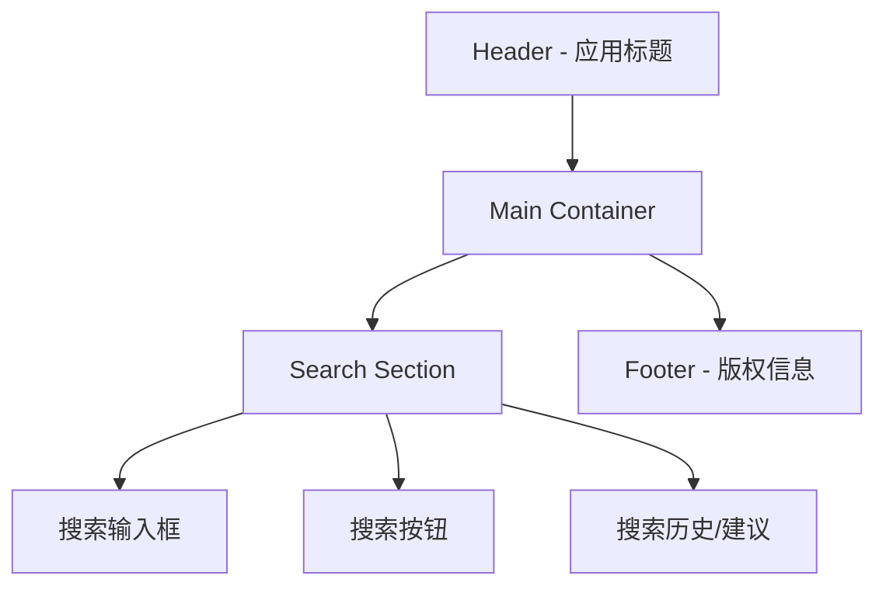
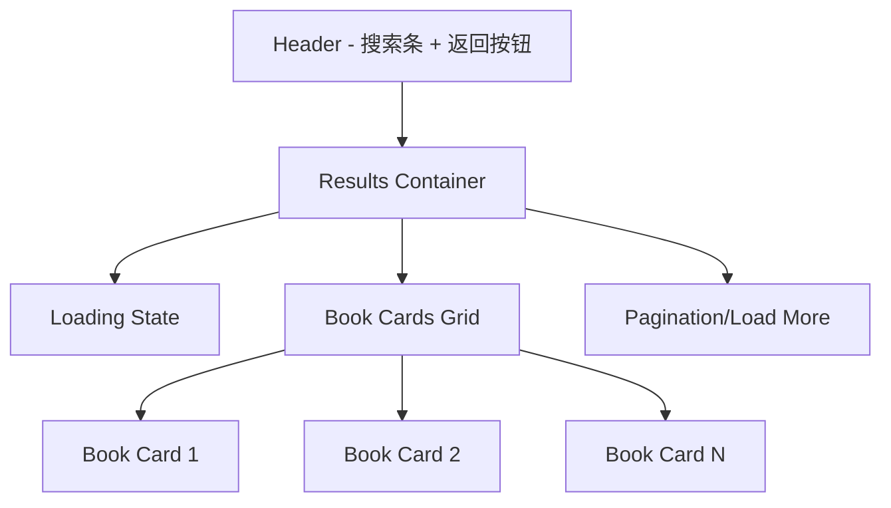
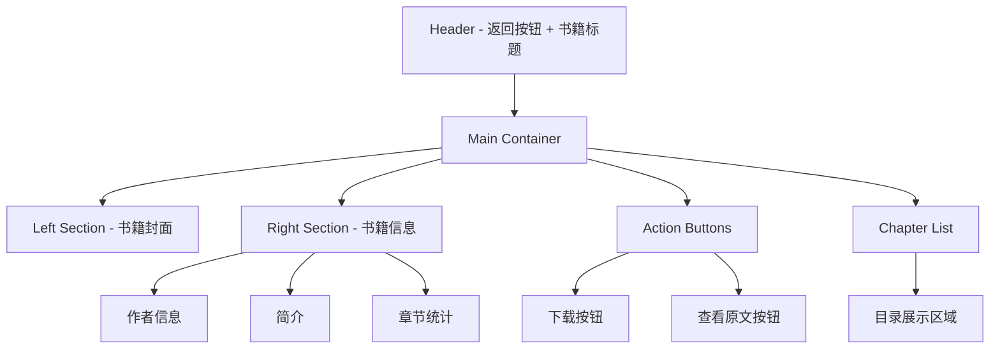
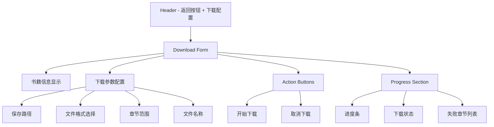
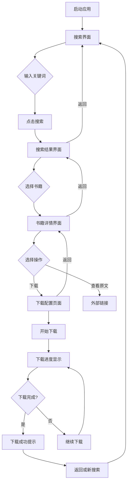

# 小说爬虫前端UI重构设计文档

## 概述

本文档描述小说爬虫项目的前端UI重构方案，采用现代化暗色调设计风格，构建响应式、交互友好的用户界面。前端将基于Vue 3 + TypeScript技术栈，与后端FastAPI保持完美的数据交互。

## 技术栈与架构

### 核心技术栈
- **前端框架**: Vue 3 + TypeScript
- **构建工具**: Vite
- **UI组件库**: Element Plus
- **样式方案**: Tailwind CSS + SCSS
- **状态管理**: Pinia
- **HTTP客户端**: Axios
- **路由管理**: Vue Router
- **动画库**: GSAP + Lottie
- **运行环境**: Node.js

### 项目结构
```
UI/
├── public/                     # 静态资源
│   ├── favicon.ico
│   └── index.html
├── src/
│   ├── assets/                 # 资源文件
│   │   ├── images/
│   │   ├── animations/         # Lottie动画文件
│   │   └── styles/            # 全局样式
│   ├── components/            # 通用组件
│   │   ├── common/            # 基础组件
│   │   ├── loading/           # 加载动画组件
│   │   └── animations/        # 动画组件
│   ├── views/                 # 页面组件
│   │   ├── SearchView.vue     # 搜索界面
│   │   ├── ResultsView.vue    # 搜索结果界面
│   │   ├── DetailView.vue     # 书籍详情界面
│   │   └── DownloadView.vue   # 下载页面
│   ├── stores/                # Pinia状态管理
│   │   ├── search.ts
│   │   ├── book.ts
│   │   └── download.ts
│   ├── api/                   # API接口封装
│   │   ├── index.ts
│   │   ├── search.ts
│   │   ├── catalog.ts
│   │   └── download.ts
│   ├── types/                 # TypeScript类型定义
│   │   ├── api.ts
│   │   ├── book.ts
│   │   └── common.ts
│   ├── utils/                 # 工具函数
│   │   ├── request.ts         # HTTP请求封装
│   │   ├── format.ts          # 数据格式化
│   │   └── animation.ts       # 动画工具
│   ├── router/                # 路由配置
│   │   └── index.ts
│   ├── App.vue               # 根组件
│   └── main.ts               # 应用入口
├── package.json              # 项目配置
├── tsconfig.json            # TypeScript配置
├── vite.config.ts           # Vite配置
├── tailwind.config.js       # Tailwind配置
└── README.md               # 项目说明
```

## 设计风格与主题

### 色彩方案
基于暗色调设计，营造现代、专业的视觉体验：

**主色彩**:
- 主背景色: `#0F172A` (slate-900)
- 次要背景色: `#1E293B` (slate-800)
- 卡片背景色: `#334155` (slate-700)
- 主要文字色: `#F8FAFC` (slate-50)
- 次要文字色: `#CBD5E1` (slate-300)

**强调色**:
- 主要强调色: `#3B82F6` (blue-500) - 用于按钮、链接
- 次要强调色: `#06B6D4` (cyan-500) - 用于进度条、状态指示
- 成功色: `#10B981` (emerald-500)
- 警告色: `#F59E0B` (amber-500)
- 错误色: `#EF4444` (red-500)

**渐变效果**:
```css
/* 主背景渐变 */
background: linear-gradient(135deg, #0F172A 0%, #1E293B 100%);

/* 卡片悬停渐变 */
background: linear-gradient(135deg, #334155 0%, #475569 100%);

/* 按钮渐变 */
background: linear-gradient(135deg, #3B82F6 0%, #1D4ED8 100%);
```

### 设计原则
1. **极简主义**: 界面简洁清晰，去除不必要的装饰元素
2. **响应式设计**: 适配桌面、平板、手机等多种设备
3. **深色优先**: 减少眼疲劳，提升夜间使用体验
4. **流畅交互**: 丰富的动画效果，提升用户体验
5. **信息层次**: 清晰的视觉层次，引导用户注意力

## 界面设计详情

### 1. 搜索界面 (SearchView)

**设计概念**: 简洁的搜索入口，突出搜索功能

**布局结构**:


**核心组件**:
- **搜索框**: 
  - 居中布局，宽度自适应
  - 占位文本: "输入小说名称或作者"
  - 支持回车键触发搜索
  - 实时搜索建议（可选）
- **搜索按钮**: 
  - 渐变背景，悬停效果
  - 加载状态显示
- **历史记录**:
  - 显示最近5次搜索记录
  - 点击快速搜索

**动画效果**:
- 页面加载: 标题从上方滑入，搜索框从下方滑入
- 搜索触发: 搜索框放大效果，按钮loading动画
- 结果跳转: 页面淡出过渡

### 2. 搜索结果界面 (ResultsView)

**设计概念**: 卡片式布局展示搜索结果，支持懒加载

**布局结构**:


**核心组件**:
- **书籍卡片**:
  - 左侧: 书籍封面图片（3:4比例）
  - 右侧: 书籍信息（标题、作者、简介）
  - 悬停效果: 卡片上浮，阴影增强
  - 点击区域: 整个卡片可点击
- **网格布局**:
  - 桌面: 2列布局
  - 平板: 1列布局
  - 手机: 1列布局
- **懒加载**:
  - 图片懒加载
  - 滚动到底部加载更多

**动画效果**:
- 搜索结果加载: 卡片依次从下方滑入
- 图片加载: 骨架屏 → 图片淡入
- 悬停交互: 卡片缩放和阴影变化

### 3. 书籍详情界面 (DetailView)

**设计概念**: 详细展示书籍信息，突出下载功能

**布局结构**:


**核心组件**:
- **书籍封面**: 
  - 大尺寸显示，支持点击放大
  - 加载失败显示默认封面
- **书籍信息**:
  - 标题: 大字体，突出显示
  - 作者: 中等字体，可点击搜索该作者其他作品
  - 简介: 小字体，支持展开/收起
  - 章节数: 徽章样式显示
- **目录列表**:
  - 虚拟滚动，支持大量章节
  - 章节标题可点击（外链）
- **操作按钮**:
  - 下载按钮: 主要按钮样式
  - 查看原文: 次要按钮样式

**响应式布局**:
- 桌面: 左右两栏布局
- 移动: 上下堆叠布局

### 4. 下载页面 (DownloadView)

**设计概念**: 功能完整的下载配置界面，实时显示下载进度

**布局结构**:


**核心组件**:
- **表单配置**:
  - 保存路径: 文本输入框，显示默认路径
  - 文件格式: 单选按钮 (txt/epub)
  - 章节范围: 数字输入框，支持范围验证
  - 文件名称: 文本输入框，预填书籍名称
- **下载进度**:
  - 圆形进度条: 显示总体进度百分比
  - 线性进度条: 显示当前章节进度
  - 状态文本: 显示当前下载章节
  - 失败列表: 显示下载失败的章节
- **实时更新**:
  - 轮询后端状态接口
  - WebSocket连接（可选）

**表单验证**:
- 必填字段验证
- 章节范围合法性检查
- 文件名格式验证

## API接口对接

### 接口封装结构

**基础配置** (`api/index.ts`):
```typescript
// API基础配置
export const API_BASE_URL = 'http://127.0.0.1:8000';

// 请求拦截器
axios.defaults.baseURL = API_BASE_URL;
axios.defaults.headers.post['Content-Type'] = 'application/json';
```

### 1. 搜索接口对接

**接口**: `POST /api/search`

**请求参数类型**:
```typescript
interface SearchRequest {
  keyword: string;
}
```

**响应数据类型**:
```typescript
interface SearchResponse {
  status: string;
  data: BookItem[];
  message: string;
  keyword: string;
}

interface BookItem {
  url_list: string;
  url_img: string;
  articlename: string;
  author: string;
  intro: string;
}
```

**API封装** (`api/search.ts`):
```typescript
export const searchBooks = async (keyword: string): Promise<SearchResponse> => {
  const response = await axios.post('/api/search', { keyword });
  return response.data;
};
```

### 2. 目录接口对接

**接口**: `POST /api/catalog`

**请求参数类型**:
```typescript
interface CatalogRequest {
  novel_id: number;
}
```

**响应数据类型**:
```typescript
interface CatalogResponse {
  status: string;
  data: CatalogData;
  message: string;
  novel_id: number;
  book_name: string;
  novel_url: string;
}

interface CatalogData {
  novel_info: NovelInfo;
  chapters: Chapter[];
}

interface NovelInfo {
  novel_id: string;
  novel_title: string;
  author: string;
  total_chapters: number;
  domain: string;
  detail_url: string;
}

interface Chapter {
  title: string;
  url: string;
}
```

### 3. 下载接口对接

**开始下载**: `POST /api/download/start`

**请求参数类型**:
```typescript
interface DownloadRequest {
  novel_url: string;
  book_name: string;
  start_chapter: number;
  end_chapter: number;
  mode: 'txt' | 'epub';
}
```

**下载状态**: `GET /api/download/status/{task_id}`

**响应数据类型**:
```typescript
interface DownloadStatusResponse {
  status: string;
  data: DownloadStatus;
}

interface DownloadStatus {
  task_id: string;
  status: 'running' | 'completed' | 'failed' | 'stopped';
  book_name: string;
  novel_url: string;
  start_chapter: number;
  end_chapter: number;
  current: number;
  total: number;
  percentage: number;
  failed_chapters: number[];
}
```

## 状态管理

### 搜索状态 (`stores/search.ts`)
```typescript
export const useSearchStore = defineStore('search', () => {
  const searchResults = ref<BookItem[]>([]);
  const searchKeyword = ref<string>('');
  const isLoading = ref<boolean>(false);
  const searchHistory = ref<string[]>([]);

  const searchBooks = async (keyword: string) => {
    isLoading.value = true;
    try {
      const response = await searchAPI(keyword);
      searchResults.value = response.data;
      searchKeyword.value = keyword;
      addToHistory(keyword);
    } finally {
      isLoading.value = false;
    }
  };

  return {
    searchResults,
    searchKeyword,
    isLoading,
    searchHistory,
    searchBooks,
  };
});
```

### 书籍详情状态 (`stores/book.ts`)
```typescript
export const useBookStore = defineStore('book', () => {
  const currentBook = ref<BookItem | null>(null);
  const bookCatalog = ref<CatalogData | null>(null);
  const isLoadingCatalog = ref<boolean>(false);

  const loadBookCatalog = async (novelId: number) => {
    isLoadingCatalog.value = true;
    try {
      const response = await getCatalog(novelId);
      bookCatalog.value = response.data;
    } finally {
      isLoadingCatalog.value = false;
    }
  };

  return {
    currentBook,
    bookCatalog,
    isLoadingCatalog,
    loadBookCatalog,
  };
});
```

### 下载状态 (`stores/download.ts`)
```typescript
export const useDownloadStore = defineStore('download', () => {
  const downloadTasks = ref<Map<string, DownloadStatus>>(new Map());
  const currentTask = ref<string | null>(null);

  const startDownload = async (params: DownloadRequest) => {
    const response = await startDownloadAPI(params);
    const taskId = response.task_id;
    currentTask.value = taskId;
    
    // 开始轮询状态
    pollDownloadStatus(taskId);
    return taskId;
  };

  const pollDownloadStatus = (taskId: string) => {
    const timer = setInterval(async () => {
      try {
        const response = await getDownloadStatus(taskId);
        downloadTasks.value.set(taskId, response.data);
        
        if (['completed', 'failed', 'stopped'].includes(response.data.status)) {
          clearInterval(timer);
        }
      } catch (error) {
        clearInterval(timer);
      }
    }, 1000);
  };

  return {
    downloadTasks,
    currentTask,
    startDownload,
    pollDownloadStatus,
  };
});
```

## 动画与交互设计

### 动画库选择

**GSAP (GreenSock Animation Platform)**:
- 高性能动画引擎
- 丰富的动画API
- 优秀的浏览器兼容性

**Lottie**:
- 矢量动画支持
- 设计师友好
- 文件体积小

**Vue Transition**:
- Vue原生过渡组件
- 路由切换动画
- CSS过渡支持

### 核心动画效果

**页面切换动画**:
```typescript
// 路由过渡配置
const pageTransition = {
  name: 'page',
  mode: 'out-in',
  enter: (el: Element) => {
    gsap.fromTo(el, 
      { opacity: 0, y: 30 }, 
      { opacity: 1, y: 0, duration: 0.3 }
    );
  },
  leave: (el: Element) => {
    gsap.to(el, { opacity: 0, y: -30, duration: 0.2 });
  }
};
```

**加载动画**:
```vue
<template>
  <div class="loading-container">
    <lottie-player
      src="/animations/book-loading.json"
      background="transparent"
      speed="1"
      loop
      autoplay
    ></lottie-player>
  </div>
</template>
```

**搜索结果动画**:
```typescript
// 结果卡片依次动画
const animateResults = (cards: NodeList) => {
  gsap.fromTo(cards, 
    { opacity: 0, y: 50 },
    { 
      opacity: 1, 
      y: 0, 
      duration: 0.4,
      stagger: 0.1,
      ease: "power2.out"
    }
  );
};
```

### 交互反馈

**按钮悬停效果**:
```scss
.btn-primary {
  @apply bg-gradient-to-r from-blue-500 to-blue-600 
         text-white px-6 py-3 rounded-lg 
         transition-all duration-300 ease-in-out;
  
  &:hover {
    @apply scale-105 shadow-lg;
    box-shadow: 0 10px 25px rgba(59, 130, 246, 0.3);
  }
  
  &:active {
    @apply scale-95;
  }
}
```

**卡片悬停效果**:
```scss
.book-card {
  @apply bg-slate-700 rounded-xl p-4 
         transition-all duration-300 ease-in-out
         cursor-pointer;
  
  &:hover {
    @apply bg-slate-600 transform -translate-y-2;
    box-shadow: 0 20px 40px rgba(0, 0, 0, 0.3);
  }
}
```

## 异常处理与用户反馈

### 错误类型定义
```typescript
// types/error.ts
export interface ApiError {
  code: string;
  message: string;
  details?: any;
}

export interface ErrorState {
  hasError: boolean;
  error: ApiError | null;
  retryCount: number;
}

export enum ErrorType {
  NETWORK_ERROR = 'NETWORK_ERROR',
  API_ERROR = 'API_ERROR',
  VALIDATION_ERROR = 'VALIDATION_ERROR',
  TIMEOUT_ERROR = 'TIMEOUT_ERROR',
  UNKNOWN_ERROR = 'UNKNOWN_ERROR'
}
```

### 全局错误处理器
```typescript
// utils/errorHandler.ts
import { ElMessage, ElNotification } from 'element-plus';
import type { ApiError, ErrorType } from '@/types/error';

export class ErrorHandler {
  static handle(error: any, context?: string): void {
    const apiError = this.parseError(error);
    
    switch (apiError.code) {
      case ErrorType.NETWORK_ERROR:
        this.showNetworkError();
        break;
      case ErrorType.API_ERROR:
        this.showApiError(apiError.message);
        break;
      case ErrorType.VALIDATION_ERROR:
        this.showValidationError(apiError.message);
        break;
      default:
        this.showUnknownError();
    }
    
    // 记录错误日志
    this.logError(apiError, context);
  }
  
  private static parseError(error: any): ApiError {
    if (error.response) {
      // API错误
      return {
        code: ErrorType.API_ERROR,
        message: error.response.data?.message || '服务器错误',
        details: error.response.data
      };
    }
    
    if (error.request) {
      // 网络错误
      return {
        code: ErrorType.NETWORK_ERROR,
        message: '网络连接失败，请检查网络设置',
        details: error.request
      };
    }
    
    // 其他错误
    return {
      code: ErrorType.UNKNOWN_ERROR,
      message: error.message || '未知错误',
      details: error
    };
  }
  
  private static showNetworkError(): void {
    ElNotification({
      title: '网络错误',
      message: '网络连接失败，请检查网络设置后重试',
      type: 'error',
      duration: 5000
    });
  }
  
  private static showApiError(message: string): void {
    ElMessage({
      message,
      type: 'error',
      duration: 3000
    });
  }
  
  private static showValidationError(message: string): void {
    ElMessage({
      message,
      type: 'warning',
      duration: 3000
    });
  }
  
  private static showUnknownError(): void {
    ElMessage({
      message: '系统发生未知错误，请稍后重试',
      type: 'error',
      duration: 3000
    });
  }
  
  private static logError(error: ApiError, context?: string): void {
    console.error('[Error Handler]', {
      error,
      context,
      timestamp: new Date().toISOString(),
      userAgent: navigator.userAgent,
      url: window.location.href
    });
  }
}
```

### 空状态组件
```vue
<!-- components/EmptyState.vue -->
<template>
  <div class="empty-state">
    <div class="empty-illustration">
      <lottie-player
        :src="illustration"
        background="transparent"
        speed="1"
        loop
        autoplay
        style="width: 200px; height: 200px;"
      ></lottie-player>
    </div>
    
    <div class="empty-content">
      <h3 class="empty-title">{{ title }}</h3>
      <p class="empty-description">{{ description }}</p>
      
      <div v-if="showAction" class="empty-actions">
        <el-button 
          type="primary" 
          @click="handleAction"
        >
          {{ actionText }}
        </el-button>
      </div>
    </div>
  </div>
</template>

<script setup lang="ts">
interface Props {
  type: 'no-data' | 'no-results' | 'error' | 'network-error';
  title?: string;
  description?: string;
  actionText?: string;
  showAction?: boolean;
}

interface Emits {
  action: [];
}

const props = withDefaults(defineProps<Props>(), {
  showAction: true
});

const emit = defineEmits<Emits>();

const illustration = computed(() => {
  switch (props.type) {
    case 'no-data':
      return '/animations/no-data.json';
    case 'no-results':
      return '/animations/no-results.json';
    case 'error':
      return '/animations/error.json';
    case 'network-error':
      return '/animations/network-error.json';
    default:
      return '/animations/no-data.json';
  }
});

const title = computed(() => {
  return props.title || getDefaultTitle(props.type);
});

const description = computed(() => {
  return props.description || getDefaultDescription(props.type);
});

const actionText = computed(() => {
  return props.actionText || getDefaultActionText(props.type);
});

const getDefaultTitle = (type: string): string => {
  switch (type) {
    case 'no-data':
      return '暂无数据';
    case 'no-results':
      return '暂无搜索结果';
    case 'error':
      return '出现错误';
    case 'network-error':
      return '网络异常';
    default:
      return '暂无数据';
  }
};

const getDefaultDescription = (type: string): string => {
  switch (type) {
    case 'no-data':
      return '暂时没有相关数据';
    case 'no-results':
      return '试试更换关键词或筛选条件';
    case 'error':
      return '系统出现错误，请稍后重试';
    case 'network-error':
      return '网络连接失败，请检查网络设置';
    default:
      return '暂时没有相关数据';
  }
};

const getDefaultActionText = (type: string): string => {
  switch (type) {
    case 'no-data':
      return '刷新页面';
    case 'no-results':
      return '重新搜索';
    case 'error':
      return '重试';
    case 'network-error':
      return '重新连接';
    default:
      return '刷新';
  }
};

const handleAction = () => {
  emit('action');
};
</script>
```

## 性能优化与测试

### 性能监控
```typescript
// utils/performance.ts
export class PerformanceMonitor {
  private static metrics: Map<string, number> = new Map();
  
  static startTiming(label: string): void {
    this.metrics.set(label, performance.now());
  }
  
  static endTiming(label: string): number {
    const startTime = this.metrics.get(label);
    if (!startTime) return 0;
    
    const duration = performance.now() - startTime;
    this.metrics.delete(label);
    
    console.log(`[Performance] ${label}: ${duration.toFixed(2)}ms`);
    return duration;
  }
  
  static measureApiCall<T>(promise: Promise<T>, apiName: string): Promise<T> {
    this.startTiming(apiName);
    
    return promise
      .then(result => {
        this.endTiming(apiName);
        return result;
      })
      .catch(error => {
        this.endTiming(apiName);
        throw error;
      });
  }
  
  static reportWebVitals(): void {
    // 报告 Core Web Vitals
    if ('web-vitals' in window) {
      import('web-vitals').then(({ getCLS, getFID, getFCP, getLCP, getTTFB }) => {
        getCLS(console.log);
        getFID(console.log);
        getFCP(console.log);
        getLCP(console.log);
        getTTFB(console.log);
      });
    }
  }
}
```

### 单元测试示例
```typescript
// tests/components/SearchBox.test.ts
import { mount } from '@vue/test-utils';
import { describe, it, expect, vi } from 'vitest';
import SearchBox from '@/components/SearchBox.vue';
import { ElInput, ElButton } from 'element-plus';

describe('SearchBox', () => {
  it('渲染搜索框', () => {
    const wrapper = mount(SearchBox, {
      global: {
        components: {
          ElInput,
          ElButton
        }
      }
    });
    
    expect(wrapper.find('.search-input').exists()).toBe(true);
    expect(wrapper.find('.search-button').exists()).toBe(true);
  });
  
  it('触发搜索事件', async () => {
    const wrapper = mount(SearchBox, {
      global: {
        components: {
          ElInput,
          ElButton
        }
      }
    });
    
    const searchSpy = vi.fn();
    wrapper.vm.$emit = searchSpy;
    
    // 输入关键词
    await wrapper.find('input').setValue('剑来');
    
    // 点击搜索按钮
    await wrapper.find('.search-button').trigger('click');
    
    expect(searchSpy).toHaveBeenCalledWith('search', '剑来');
  });
  
  it('回车键触发搜索', async () => {
    const wrapper = mount(SearchBox, {
      global: {
        components: {
          ElInput,
          ElButton
        }
      }
    });
    
    const searchSpy = vi.fn();
    wrapper.vm.$emit = searchSpy;
    
    // 输入关键词
    await wrapper.find('input').setValue('斗破苍穹');
    
    // 按下回车键
    await wrapper.find('input').trigger('keyup.enter');
    
    expect(searchSpy).toHaveBeenCalledWith('search', '斗破苍穹');
  });
});
```

### E2E测试配置
```typescript
// tests/e2e/search.spec.ts
import { test, expect } from '@playwright/test';

test.describe('搜索功能', () => {
  test('基本搜索流程', async ({ page }) => {
    // 访问首页
    await page.goto('/');
    
    // 检查搜索框存在
    await expect(page.locator('.search-input')).toBeVisible();
    
    // 输入搜索关键词
    await page.fill('.search-input input', '剑来');
    
    // 点击搜索按钮
    await page.click('.search-button');
    
    // 等待跳转到搜索结果页
    await expect(page).toHaveURL('/results?keyword=剑来');
    
    // 检查搜索结果是否显示
    await expect(page.locator('.book-card')).toBeVisible();
  });
  
  test('点击书籍进入详情页', async ({ page }) => {
    // 搜索操作
    await page.goto('/');
    await page.fill('.search-input input', '斗破苍穹');
    await page.click('.search-button');
    
    // 等待搜索结果加载
    await page.waitForSelector('.book-card');
    
    // 点击第一个书籍
    await page.click('.book-card:first-child');
    
    // 检查是否跳转到详情页
    await expect(page).toHaveURL(/\/detail\/\d+/);
    
    // 检查详情页内容
    await expect(page.locator('.book-cover')).toBeVisible();
    await expect(page.locator('.book-info')).toBeVisible();
    await expect(page.locator('.download-button')).toBeVisible();
  });
});
```

### 测试配置文件
```typescript
// vitest.config.ts
import { defineConfig } from 'vitest/config';
import vue from '@vitejs/plugin-vue';
import { resolve } from 'path';

export default defineConfig({
  plugins: [vue()],
  test: {
    environment: 'jsdom',
    globals: true,
    setupFiles: ['./tests/setup.ts']
  },
  resolve: {
    alias: {
      '@': resolve(__dirname, 'src')
    }
  }
});
```

```typescript
// playwright.config.ts
import { defineConfig, devices } from '@playwright/test';

export default defineConfig({
  testDir: './tests/e2e',
  fullyParallel: true,
  forbidOnly: !!process.env.CI,
  retries: process.env.CI ? 2 : 0,
  workers: process.env.CI ? 1 : undefined,
  reporter: 'html',
  
  use: {
    baseURL: 'http://localhost:3000',
    trace: 'on-first-retry',
    screenshot: 'only-on-failure'
  },
  
  projects: [
    {
      name: 'chromium',
      use: { ...devices['Desktop Chrome'] }
    },
    {
      name: 'firefox',
      use: { ...devices['Desktop Firefox'] }
    },
    {
      name: 'webkit',
      use: { ...devices['Desktop Safari'] }
    },
    {
      name: 'mobile-chrome',
      use: { ...devices['Pixel 5'] }
    }
  ],
  
  webServer: {
    command: 'npm run dev',
    url: 'http://localhost:3000',
    reuseExistingServer: !process.env.CI
  }
});
```

## 响应式设计

### 断点设置
```javascript
// tailwind.config.js
module.exports = {
  theme: {
    screens: {
      'sm': '640px',   // 手机横屏
      'md': '768px',   // 平板
      'lg': '1024px',  // 小桌面
      'xl': '1280px',  // 大桌面
      '2xl': '1536px', // 超大桌面
    }
  }
}
```

### 布局适配策略

**搜索界面**:
- 桌面: 居中布局，固定最大宽度
- 移动: 全宽布局，适当内边距

**搜索结果**:
- 桌面: 2列网格布局
- 平板: 1列布局，卡片稍大
- 手机: 1列布局，紧凑样式

**书籍详情**:
- 桌面: 左右分栏布局
- 移动: 上下堆叠布局

**下载页面**:
- 桌面: 表单在左，进度在右
- 移动: 上下堆叠，全宽显示

### 触摸优化

**按钮尺寸**:
- 最小点击区域 44px × 44px
- 按钮间距不少于 8px

**滚动优化**:
- 惯性滚动支持
- 滚动到顶部/底部的反馈

**手势支持**:
- 左右滑动返回上级页面
- 下拉刷新搜索结果

## 性能优化

### 代码分割
```typescript
// 路由懒加载
const routes = [
  {
    path: '/',
    component: () => import('@/views/SearchView.vue')
  },
  {
    path: '/results',
    component: () => import('@/views/ResultsView.vue')
  },
  {
    path: '/detail/:id',
    component: () => import('@/views/DetailView.vue')
  },
  {
    path: '/download',
    component: () => import('@/views/DownloadView.vue')
  }
];
```

### 图片优化
- 图片懒加载
- WebP格式支持
- 响应式图片
- 默认占位图

### 缓存策略
- API响应缓存
- 图片缓存
- 组件缓存
- 路由缓存

### 包体积优化
- Tree shaking
- 按需引入组件库
- 压缩资源文件
- CDN加速

## 开发工具配置

### 包管理器配置 (`package.json`)
```json
{
  "name": "novel-crawler-ui",
  "version": "1.0.0",
  "type": "module",
  "scripts": {
    "dev": "vite",
    "build": "vue-tsc && vite build",
    "preview": "vite preview",
    "lint": "eslint src --ext .ts,.vue",
    "type-check": "vue-tsc --noEmit"
  },
  "dependencies": {
    "vue": "^3.4.0",
    "vue-router": "^4.2.0",
    "pinia": "^2.1.0",
    "axios": "^1.6.0",
    "element-plus": "^2.4.0",
    "@element-plus/icons-vue": "^2.3.0"
  },
  "devDependencies": {
    "@vitejs/plugin-vue": "^4.5.0",
    "typescript": "^5.3.0",
    "vue-tsc": "^1.8.0",
    "vite": "^5.0.0",
    "tailwindcss": "^3.3.0",
    "autoprefixer": "^10.4.0",
    "postcss": "^8.4.0",
    "sass": "^1.69.0",
    "gsap": "^3.12.0",
    "lottie-web": "^5.12.0"
  }
}
```

### Vite配置 (`vite.config.ts`)
```typescript
import { defineConfig } from 'vite';
import vue from '@vitejs/plugin-vue';
import { resolve } from 'path';

export default defineConfig({
  plugins: [vue()],
  resolve: {
    alias: {
      '@': resolve(__dirname, 'src'),
    },
  },
  server: {
    port: 3000,
    proxy: {
      '/api': {
        target: 'http://127.0.0.1:8000',
        changeOrigin: true,
      },
    },
  },
  build: {
    outDir: 'dist',
    sourcemap: false,
    rollupOptions: {
      output: {
        manualChunks: {
          vendor: ['vue', 'vue-router', 'pinia'],
          ui: ['element-plus'],
          animations: ['gsap', 'lottie-web'],
        },
      },
    },
  },
});
```

### TypeScript配置 (`tsconfig.json`)
```json
{
  "compilerOptions": {
    "target": "ES2020",
    "useDefineForClassFields": true,
    "lib": ["ES2020", "DOM", "DOM.Iterable"],
    "module": "ESNext",
    "skipLibCheck": true,
    "moduleResolution": "bundler",
    "allowImportingTsExtensions": true,
    "resolveJsonModule": true,
    "isolatedModules": true,
    "noEmit": true,
    "jsx": "preserve",
    "strict": true,
    "noUnusedLocals": true,
    "noUnusedParameters": true,
    "noFallthroughCasesInSwitch": true,
    "baseUrl": ".",
    "paths": {
      "@/*": ["src/*"]
    }
  },
  "include": ["src/**/*.ts", "src/**/*.d.ts", "src/**/*.tsx", "src/**/*.vue"],
  "references": [{ "path": "./tsconfig.node.json" }]
}
```

## 推荐开源动画库

### 1. 加载动画库

**Vue Loading Overlay**:
- GitHub: https://github.com/ankurk91/vue-loading-overlay
- 功能: 全屏loading、局部loading、自定义样式
- 安装: `npm install vue-loading-overlay`

**Vue Spinner**:
- GitHub: https://github.com/greyby/vue-spinner
- 功能: 多种spinner样式、颜色可定制
- 安装: `npm install vue-spinner`

**Epic Spinners**:
- GitHub: https://github.com/epicmaxco/epic-spinners
- 功能: 30+种精美loading动画
- 安装: `npm install epic-spinners`

### 2. 过渡动画库

**Vue Transition Modes**:
- GitHub: https://github.com/BinarCode/vue-form-wizard
- 功能: 页面切换过渡效果
- 特点: 轻量级、易于集成

**Vue Page Transition**:
- GitHub: https://github.com/Orlandster/vue-page-transition
- 功能: 页面级过渡动画
- 特点: 多种内置效果

### 3. 进度条动画库

**Vue Progressbar**:
- GitHub: https://github.com/hilongjw/vue-progressbar
- 功能: 页面顶部进度条、API请求进度
- 特点: 高度可定制、支持多种样式

**Vue Progress Path**:
- GitHub: https://github.com/Akryum/vue-progress-path
- 功能: SVG路径进度动画
- 特点: 支持复杂路径、动画流畅

**NProgress for Vue**:
- GitHub: https://github.com/rstacruz/nprogress
- 功能: 简洁的顶部进度条
- 特点: 轻量级、GitHub同款样式

### 4. 通用动画库

**Vue Kinesis**:
- GitHub: https://github.com/Aminerman/vue-kinesis
- 功能: 交互式动画、鼠标跟随效果
- 特点: 物理引擎、性能优秀

**Vue Reveal**:
- GitHub: https://github.com/vue-comps/vue-reveal
- 功能: 滚动触发动画、元素进入动画
- 特点: 基于Intersection Observer

**AOS (Animate On Scroll)**:
- GitHub: https://github.com/michalsnik/aos
- 功能: 滚动动画库
- 特点: CSS3动画、配置简单

### 5. 图标动画库

**Vue Feather Icons**:
- GitHub: https://github.com/fengyuanchen/vue-feather
- 功能: Feather图标集成
- 特点: SVG图标、支持动画

**Vue Heroicons**:
- GitHub: https://github.com/tailwindlabs/heroicons
- 功能: Heroicons图标库
- 特点: Tailwind CSS官方图标

### 推荐组合方案

**方案一: 轻量级组合**
```bash
npm install vue-loading-overlay nprogress aos
```
- 加载: vue-loading-overlay
- 进度: nprogress
- 滚动动画: aos

**方案二: 功能完整组合**
```bash
npm install epic-spinners vue-progressbar vue-kinesis lottie-web gsap
```
- 加载动画: epic-spinners
- 进度条: vue-progressbar  
- 交互动画: vue-kinesis
- 复杂动画: lottie-web + gsap

## 界面导航流程

### 用户操作流程图


### 页面路由设计
```typescript
// router/index.ts
const routes = [
  {
    path: '/',
    name: 'Search',
    component: SearchView,
    meta: { title: '搜索小说' }
  },
  {
    path: '/results',
    name: 'Results', 
    component: ResultsView,
    meta: { title: '搜索结果' },
    props: route => ({ keyword: route.query.keyword })
  },
  {
    path: '/detail/:index',
    name: 'Detail',
    component: DetailView,
    meta: { title: '书籍详情' },
    props: true
  },
  {
    path: '/download',
    name: 'Download',
    component: DownloadView,
    meta: { title: '下载设置' },
    props: route => ({ 
      novelUrl: route.query.novelUrl,
      bookName: route.query.bookName 
    })
  }
];
```

## 核心组件设计

### 1. 搜索组件 (SearchBox.vue)
```vue
<template>
  <div class="search-container">
    <div class="search-wrapper">
      <el-input
        v-model="keyword"
        :placeholder="placeholder"
        size="large"
        class="search-input"
        @keyup.enter="handleSearch"
        @input="handleInput"
      >
        <template #prefix>
          <el-icon><Search /></el-icon>
        </template>
        <template #suffix>
          <el-button 
            v-if="keyword"
            link 
            @click="clearKeyword"
          >
            <el-icon><Close /></el-icon>
          </el-button>
        </template>
      </el-input>
      
      <el-button 
        type="primary"
        size="large"
        :loading="loading"
        @click="handleSearch"
        class="search-button"
      >
        {{ loading ? '搜索中...' : '搜索' }}
      </el-button>
    </div>
    
    <!-- 搜索建议 -->
    <div v-if="showSuggestions" class="suggestions">
      <div 
        v-for="suggestion in suggestions"
        :key="suggestion"
        class="suggestion-item"
        @click="selectSuggestion(suggestion)"
      >
        {{ suggestion }}
      </div>
    </div>
  </div>
</template>

<script setup lang="ts">
import { ref, computed } from 'vue';
import { Search, Close } from '@element-plus/icons-vue';

interface Props {
  placeholder?: string;
  loading?: boolean;
}

interface Emits {
  search: [keyword: string];
}

const props = withDefaults(defineProps<Props>(), {
  placeholder: '输入小说名称或作者',
  loading: false
});

const emit = defineEmits<Emits>();

const keyword = ref('');
const suggestions = ref(['剑来', '斗破苍穹', '完美世界']);

const showSuggestions = computed(() => 
  keyword.value.length > 0 && suggestions.value.length > 0
);

const handleSearch = () => {
  if (keyword.value.trim()) {
    emit('search', keyword.value.trim());
  }
};

const handleInput = () => {
  // 实时搜索建议逻辑
};

const clearKeyword = () => {
  keyword.value = '';
};

const selectSuggestion = (suggestion: string) => {
  keyword.value = suggestion;
  handleSearch();
};
</script>
```

### 2. 书籍卡片组件 (BookCard.vue)
```vue
<template>
  <div 
    class="book-card"
    @click="handleClick"
    @mouseenter="handleMouseEnter"
    @mouseleave="handleMouseLeave"
  >
    <div class="book-cover">
      <el-image
        :src="book.url_img"
        :alt="book.articlename"
        fit="cover"
        loading="lazy"
        class="cover-image"
      >
        <template #placeholder>
          <div class="image-placeholder">
            <el-icon><Picture /></el-icon>
          </div>
        </template>
        <template #error>
          <div class="image-error">
            <el-icon><Picture /></el-icon>
            <span>加载失败</span>
          </div>
        </template>
      </el-image>
      
      <!-- 悬停遮罩 -->
      <div class="cover-overlay" v-show="isHovered">
        <el-button type="primary" size="small">
          查看详情
        </el-button>
      </div>
    </div>
    
    <div class="book-info">
      <h3 class="book-title">{{ book.articlename }}</h3>
      <p class="book-author">{{ book.author }}</p>
      <p class="book-intro">{{ truncatedIntro }}</p>
    </div>
  </div>
</template>

<script setup lang="ts">
import { ref, computed } from 'vue';
import { Picture } from '@element-plus/icons-vue';
import type { BookItem } from '@/types/book';

interface Props {
  book: BookItem;
  index: number;
}

interface Emits {
  click: [book: BookItem, index: number];
}

const props = defineProps<Props>();
const emit = defineEmits<Emits>();

const isHovered = ref(false);

const truncatedIntro = computed(() => {
  const intro = props.book.intro || '';
  return intro.length > 100 ? intro.slice(0, 100) + '...' : intro;
});

const handleClick = () => {
  emit('click', props.book, props.index);
};

const handleMouseEnter = () => {
  isHovered.value = true;
};

const handleMouseLeave = () => {
  isHovered.value = false;
};
</script>
```

### 3. 下载进度组件 (DownloadProgress.vue)
```vue
<template>
  <div class="download-progress">
    <!-- 圆形进度 -->
    <div class="circular-progress">
      <el-progress
        type="circle"
        :percentage="percentage"
        :width="120"
        :stroke-width="8"
        :color="progressColor"
      >
        <template #default>
          <span class="progress-text">
            {{ percentage }}%
          </span>
        </template>
      </el-progress>
    </div>
    
    <!-- 详细信息 -->
    <div class="progress-details">
      <div class="progress-info">
        <span class="current">{{ status.current }}</span>
        <span class="separator">/</span>
        <span class="total">{{ status.total }}</span>
        <span class="unit">章节</span>
      </div>
      
      <div class="status-text">
        {{ statusText }}
      </div>
      
      <!-- 线性进度条 -->
      <el-progress
        :percentage="percentage"
        :color="progressColor"
        :show-text="false"
        class="linear-progress"
      />
    </div>
    
    <!-- 失败章节 -->
    <div v-if="failedChapters.length > 0" class="failed-chapters">
      <el-alert
        title="部分章节下载失败"
        type="warning"
        :closable="false"
      >
        <template #default>
          <div class="failed-list">
            失败章节: {{ failedChapters.join(', ') }}
          </div>
        </template>
      </el-alert>
    </div>
  </div>
</template>

<script setup lang="ts">
import { computed } from 'vue';
import type { DownloadStatus } from '@/types/download';

interface Props {
  status: DownloadStatus;
}

const props = defineProps<Props>();

const percentage = computed(() => {
  if (props.status.total === 0) return 0;
  return Math.round((props.status.current / props.status.total) * 100);
});

const progressColor = computed(() => {
  const p = percentage.value;
  if (p < 30) return '#f56565'; // 红色
  if (p < 70) return '#ed8936'; // 橙色
  return '#48bb78'; // 绿色
});

const statusText = computed(() => {
  switch (props.status.status) {
    case 'running':
      return `正在下载第 ${props.status.current} 章...`;
    case 'completed':
      return '下载完成';
    case 'failed':
      return '下载失败';
    case 'stopped':
      return '下载已停止';
    default:
      return '准备中...';
  }
});

const failedChapters = computed(() => 
  props.status.failed_chapters || []
);
</script>
```

## 部署方案

### 开发环境
```bash
# 安装依赖
npm install

# 启动开发服务器
npm run dev

# 访问地址: http://localhost:3000
```

### 生产构建
```bash
# 构建生产版本
npm run build

# 预览构建结果
npm run preview
```

### 部署配置
- 静态文件托管 (Nginx/Apache)
- CDN加速配置
- 环境变量配置
- API代理设置