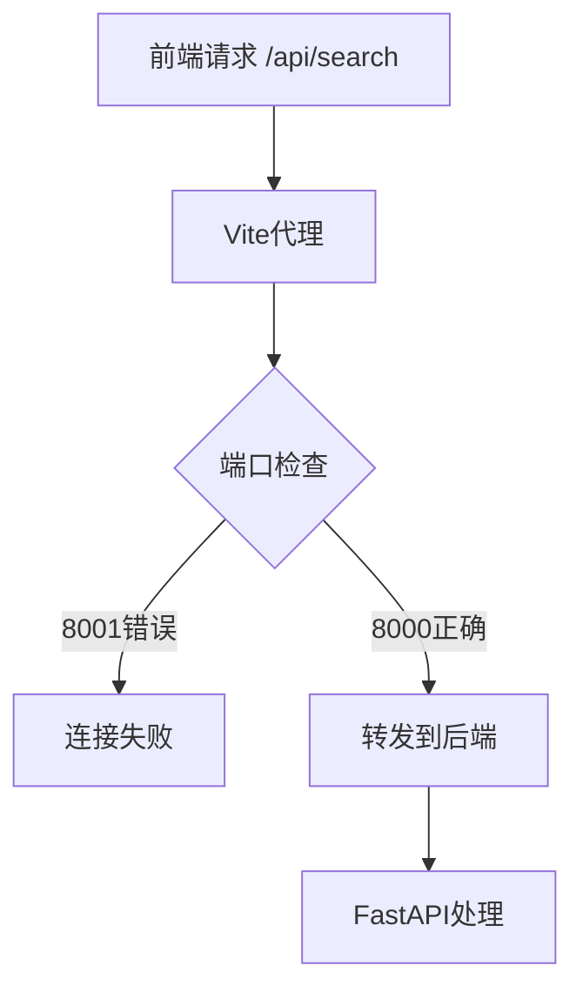
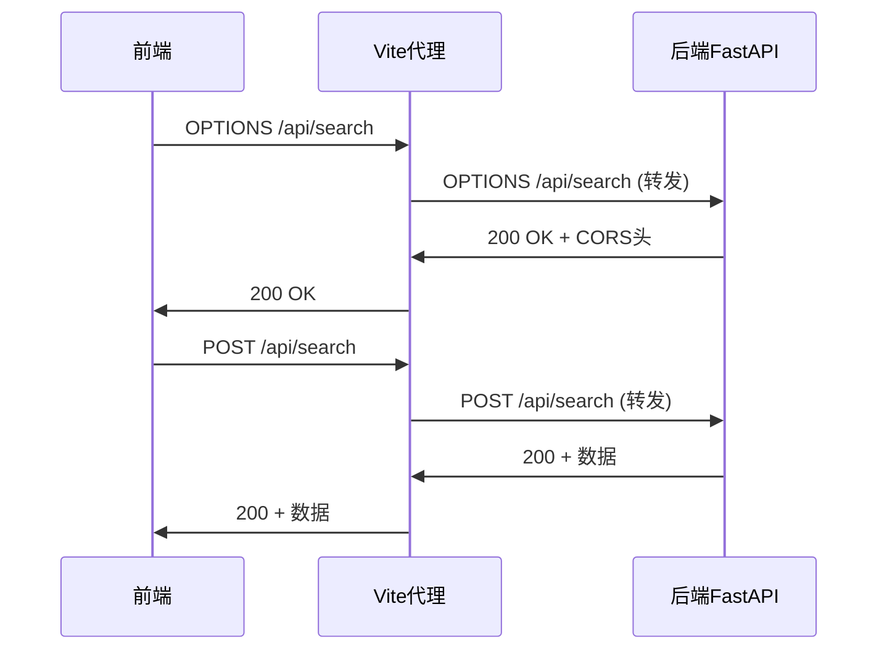

# 前端API请求问题修复设计文档

## 一、问题分析

### 1. 核心问题
从后端日志可以看到：
```
INFO:     127.0.0.1:57475 - "OPTIONS /api/search HTTP/1.1" 400 Bad Request
```

前端发送OPTIONS预检请求时返回400错误，主要原因：

1. **代理配置错误**：Vite配置中代理目标为`8001`端口，但后端运行在`8000`端口
2. **CORS预检请求处理**：OPTIONS请求没有正确处理请求体验证
3. **请求头配置**：可能存在不必要的请求头导致预检失败

### 2. 技术栈
- **前端框架**：Vue 3 + TypeScript + Vite
- **HTTP客户端**：Axios
- **后端框架**：FastAPI
- **开发服务器**：前端3000端口，后端8000端口

## 二、解决方案

### 1. Vite代理配置修复

**问题**：当前Vite配置代理到8001端口，但后端运行在8000端口

**解决方案**：修正`vite.config.ts`中的代理配置

```typescript
// 当前错误配置
proxy: {
  '/api': {
    target: 'http://127.0.0.1:8001', // 错误端口
    changeOrigin: true,
    secure: false,
  },
}

// 修正后配置
proxy: {
  '/api': {
    target: 'http://127.0.0.1:8000', // 正确端口
    changeOrigin: true,
    secure: false,
    timeout: 30000,
    headers: {
      'Accept': 'application/json',
      'Content-Type': 'application/json',
    }
  },
}
```

### 2. HTTP客户端优化

**问题**：当前HTTP客户端可能发送了不必要的请求头

**解决方案**：简化axios配置，确保OPTIONS请求正确处理

```typescript
// 优化后的默认配置
const DEFAULT_CONFIG: ApiConfig = {
  baseURL: import.meta.env.VITE_API_URL || 'http://127.0.0.1:8000',
  timeout: 30000,
  headers: {
    'Content-Type': 'application/json',
  },
  withCredentials: false,
};
```

### 3. 后端OPTIONS处理增强

**问题**：FastAPI可能没有正确处理OPTIONS预检请求

**解决方案**：在FastAPI中增加OPTIONS请求的显式处理

```python
# 在main.py中添加OPTIONS处理
@app.options("/api/{path:path}")
async def options_handler(path: str):
    """处理OPTIONS预检请求"""
    return {"message": "OK"}
```

### 4. 环境变量配置

**解决方案**：创建正确的环境变量配置

```env
# .env.development
VITE_API_URL=http://127.0.0.1:8000

# .env.production  
VITE_API_URL=http://127.0.0.1:8000
```

## 三、修复步骤

### 步骤1：修复Vite代理配置
修改`UI/vite.config.ts`文件中的代理端口从8001改为8000

### 步骤2：优化HTTP请求配置
简化axios请求头配置，移除可能导致CORS问题的自定义头

### 步骤3：添加环境变量
创建`.env`文件配置正确的API地址

### 步骤4：后端增强CORS支持
在FastAPI中添加OPTIONS请求显式处理

### 步骤5：测试验证
1. 重启前端开发服务器
2. 确保后端运行在8000端口
3. 测试搜索功能
4. 验证网络请求是否正常

## 四、实现细节

### 1. Vite配置修改



### 2. CORS请求流程



### 3. 错误处理机制

- **代理错误**：显示连接失败提示
- **CORS错误**：自动重试或降级处理
- **超时错误**：增加重试机制
- **格式错误**：数据验证和转换

## 五、配置文件模板

### 1. Vite配置完整版本

```typescript
export default defineConfig({
  plugins: [vue(), vueDevTools(), tailwindcss()],
  resolve: {
    alias: {
      '@': fileURLToPath(new URL('./src', import.meta.url))
    },
  },
  server: {
    port: 3000,
    open: true,
    proxy: {
      '/api': {
        target: 'http://127.0.0.1:8000',
        changeOrigin: true,
        secure: false,
        timeout: 30000,
      },
    },
  },
  css: {
    preprocessorOptions: {
      scss: {
        additionalData: `@use "@/assets/styles/variables.scss" as *;`,
      },
    },
  },
})
```

### 2. 环境变量配置

```env
# .env
VITE_API_URL=http://127.0.0.1:8000
VITE_APP_TITLE=小说爬虫
VITE_REQUEST_TIMEOUT=30000
```

### 3. HTTP客户端简化配置

```typescript
const DEFAULT_CONFIG: ApiConfig = {
  baseURL: import.meta.env.VITE_API_URL || 'http://127.0.0.1:8000',
  timeout: 30000,
  headers: {
    'Content-Type': 'application/json',
  },
};
```

## 六、测试验证

### 1. 验证检查清单

- [ ] Vite代理端口正确（8000）
- [ ] 后端服务运行正常
- [ ] 前端可以发送OPTIONS请求
- [ ] 搜索功能正常工作
- [ ] 网络面板无CORS错误
- [ ] 开发者工具无错误信息

### 2. 测试用例

```typescript
// 测试搜索功能
describe('搜索API测试', () => {
  test('基础搜索功能', async () => {
    const result = await searchBooks({ keyword: '剑来' });
    expect(result.status).toBe('success');
    expect(Array.isArray(result.data)).toBe(true);
  });
  
  test('空关键词处理', async () => {
    await expect(searchBooks({ keyword: '' }))
      .rejects.toThrow('搜索关键词不能为空');
  });
});
```

## 七、后续优化建议

### 1. 开发体验优化
- 添加请求Loading状态
- 增加错误重试机制
- 完善错误提示信息

### 2. 性能优化
- 实现请求缓存
- 添加防抖处理
- 优化网络超时时间

### 3. 监控和调试
- 添加请求日志
- 集成错误监控
- 性能指标收集

这个设计文档提供了完整的问题分析和解决方案，主要解决了Vite代理端口配置错误导致的CORS预检请求失败问题。